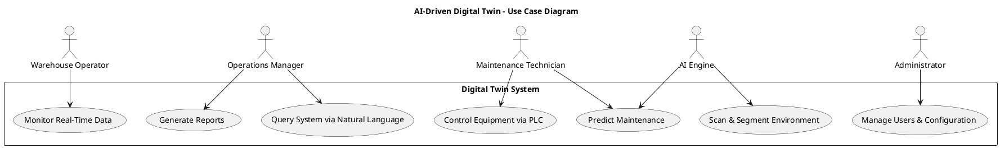

# Use Case Diagram

This diagram illustrates the key interactions between system actors and the AI-Driven Digital Twin platform.

## Actor Descriptions

**Warehouse Operator:** Monitors real-time data from warehouse sensors and equipment.

**Maintenance Technician:** Controls PLC-connected machinery and schedules maintenance activities.

**Operations Manager:** Views performance metrics, generates reports, and queries the system.

**Administrator:** Manages system configuration, user access, and infrastructure.

**AI Engine:** Performs automated environment scanning, segmentation, and predictive analysis.

## Use Case Descriptions

- **UC1 - Scan & Segment Environment:** Automated spatial mapping and object detection
- **UC2 - Monitor Real-Time Data:** Live viewing of sensor and equipment status
- **UC3 - Predict Maintenance:** AI-driven predictive analysis for equipment maintenance
- **UC4 - Control Equipment via PLC:** Direct control of warehouse machinery and systems
- **UC5 - Generate Reports:** Creation of performance and operational reports
- **UC6 - Query System via Natural Language:** Natural language interface for system queries
- **UC7 - Manage Users & Configuration:** System administration and configuration management
